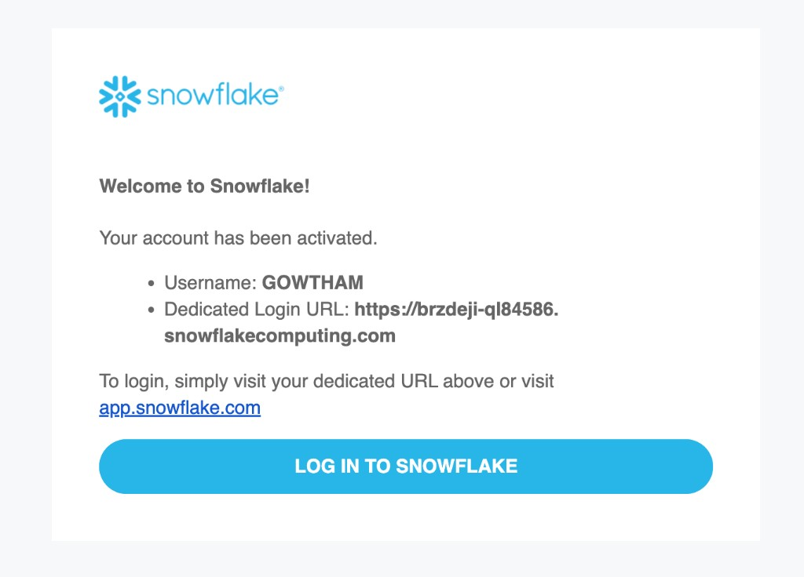
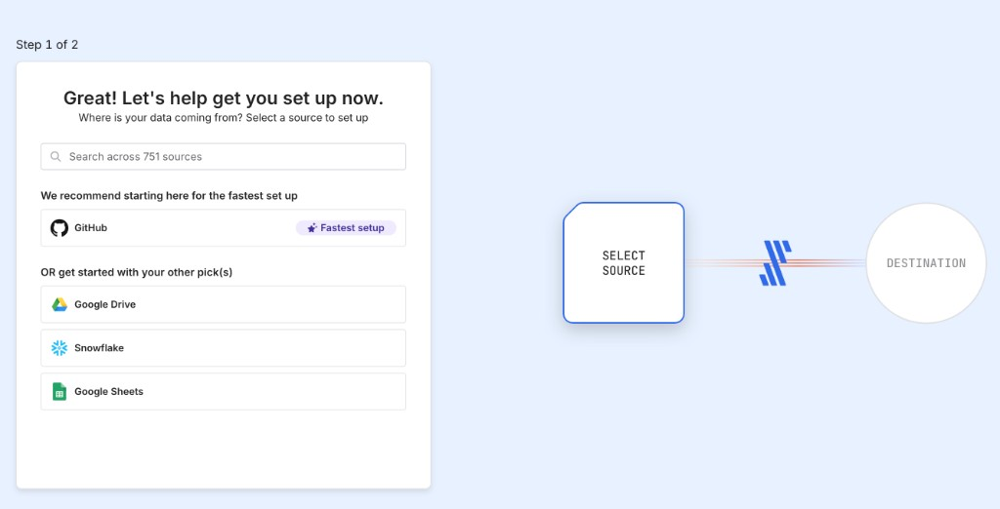
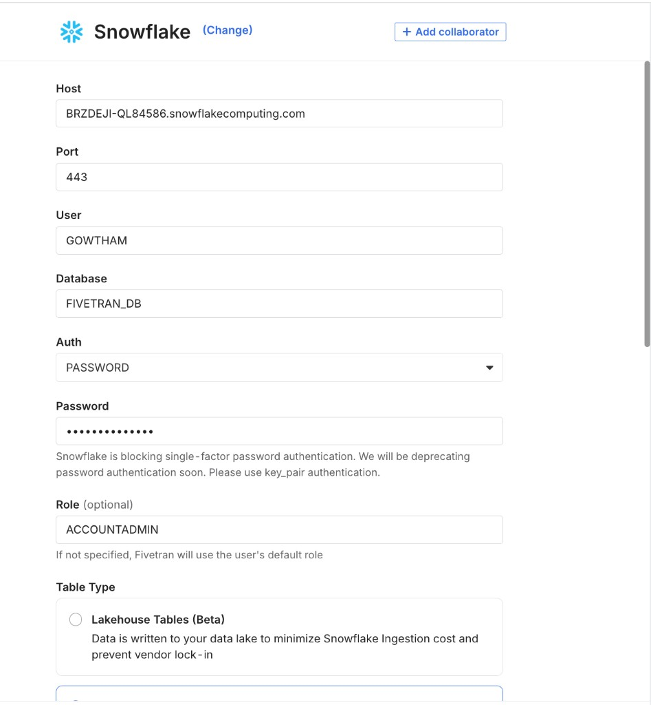
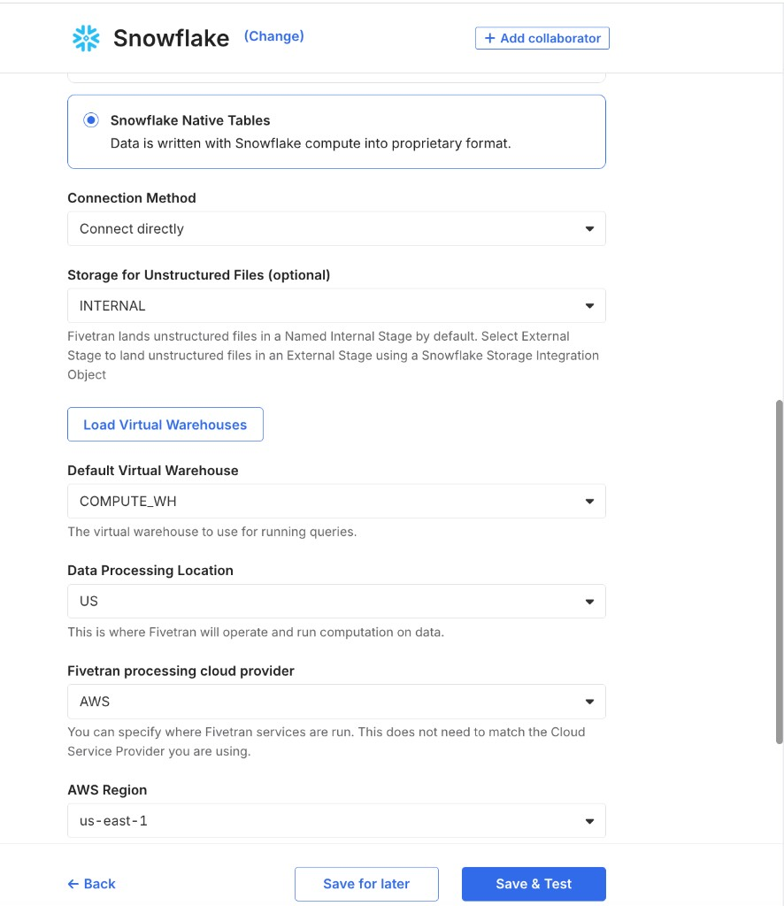

# Fivetran → Snowflake → dbt

Google Sheets holds orders. Fivetran copies them into `FIVETRAN_DB.RAW`. dbt writes cleaned metrics into `ECOMMERCE_POC_DB.MARTS`. You query `MARTS`.

```text
Google Sheets  →  Fivetran  →  FIVETRAN_DB.RAW  →  dbt  →  ECOMMERCE_POC_DB.MARTS  →  SELECT
```

Snowflake terms used below: **account** = id in the login URL (not your email); **warehouse** = compute; **database** = top folder; **schema** = folder inside it; **table** = rows.

Run SQL in the Snowflake website (**Projects → Workspaces**). Ticket: [DATA-7705](https://redhat.atlassian.net/browse/DATA-7705).

---

### 1. Create accounts and clone the repo

Sign up at [Snowflake](https://signup.snowflake.com), [Fivetran](https://fivetran.com/signup), and Google Sheets. Install the CLI and clone this repo.

After signup, Snowflake sends this email. **Username** (`GOWTHAM`) is `user` in the CLI. The dedicated URL host before `.snowflakecomputing.com` (`brzdeji-ql84586`) is `account`.



```bash
brew install snowflake-cli
git clone https://github.com/GowthamShanmugam/ddis-onboarding-lab.git
cd ddis-onboarding-lab
```

Get your Snowflake account id. You will paste it in the CLI (step 3), Fivetran (step 5), and dbt (step 7).

1. Open [https://app.snowflake.com](https://app.snowflake.com) and sign in.
2. Left menu: **Projects → Workspaces**.
3. **+** → **SQL File**. Name it `get_account_id.sql`.
4. Top of the editor: role `ACCOUNTADMIN`, warehouse `COMPUTE_WH`.
5. Paste, then click Run (`Cmd+Enter`):

```sql
SELECT CURRENT_ORGANIZATION_NAME() || '-' || CURRENT_ACCOUNT_NAME() AS ACCOUNT_IDENTIFIER;
```


6. Copy the result (example: `BRZDEJI-QL84586`). Keep it in a local note. Do not add `.snowflakecomputing.com` except in Fivetran Host.

---

### 2. Create the databases and schemas

Creates `FIVETRAN_DB.RAW` (landing) and `ECOMMERCE_POC_DB.MARTS` (dbt output). Run this in the same Workspaces SQL file. If `COMPUTE_WH` is missing, run `SHOW WAREHOUSES` and use a warehouse that exists.

```sql
USE ROLE ACCOUNTADMIN;
USE WAREHOUSE COMPUTE_WH;

CREATE DATABASE IF NOT EXISTS FIVETRAN_DB;
CREATE SCHEMA IF NOT EXISTS FIVETRAN_DB.RAW;

CREATE DATABASE IF NOT EXISTS ECOMMERCE_POC_DB;
CREATE SCHEMA IF NOT EXISTS ECOMMERCE_POC_DB.MARTS;
```

---

### 3. Connect the Snowflake CLI

Tells `snow` which account to use. Password stays in the environment, not in the file.

```toml
# ~/.snowflake/config.toml   then: chmod 0600 ~/.snowflake/config.toml
default_connection_name = "poc"

[connections.poc]
account = "<account_identifier>"   # SQL result, e.g. BRZDEJI-QL84586  — not your login name
user = "<username>"                # Snowflake login, e.g. GOWTHAM
role = "ACCOUNTADMIN"
warehouse = "COMPUTE_WH"
database = "FIVETRAN_DB"
schema = "RAW"
```

```bash
export SNOWFLAKE_PASSWORD='<password>'
snow --config-file="$HOME/.snowflake/config.toml" connection test
```

Expect Status `OK`.

---

### 4. Load sample orders into Google Sheets

This is the source system. Fivetran reads a **named range**, not the tab name.

1. New spreadsheet: name `ecommerce-poc-orders`. Rename the tab to `orders`.
2. Paste [data/orders.csv](./data/orders.csv) (including header) at A1.
3. Select **A1:I31** (all pasted cells, not only A1).
4. **Data → Named ranges**. Set **Name** to `orders`. Set **Range** to `orders!A1:I31`. Click Done.

---

### 5. Fivetran source: Google Sheets form

Use **User OAuth** (Authorize with User account). Skip Service Account.

In [fivetran.com](https://fivetran.com), first-run **Step 1 of 2**: click **Google Sheets**.




Fill the form in this order ([Fivetran setup guide](https://fivetran.com/docs/connectors/files/google-sheets/google-sheets-setup-guide)):

1. **Destination schema** — type `raw` (replace `google_sheets`). Fivetran creates `FIVETRAN_DB.RAW` if it is missing.
2. **Destination table** — type `orders`.
3. **Destination names** — Fivetran naming.
4. **Authentication Method** — Authorize with User account.
5. Click **Authorize**. Sign in with Google. Allow access.
6. **Sheet URL** — paste the URL from the Google Sheets address bar.
7. **Named Range** — pick `orders`.
8. Leave **Data processing location** and **cloud provider** as they are.
9. Click **Save & Test**.

---

### 6. Fivetran destination: Snowflake

**Step 2 of 2:** keep **Set up your destination**. Click **Snowflake**.






| Field | Value |
|---|---|
| Host | `BRZDEJI-QL84586.snowflakecomputing.com` |
| Port | `443` |
| User | `GOWTHAM` |
| Database | `FIVETRAN_DB` |
| Auth | PASSWORD |
| Password | your Snowflake password |
| Role | `ACCOUNTADMIN` |
| Table type | Snowflake Native Tables |
| Connection method | Connect directly |
| Storage for unstructured files | INTERNAL |
| Load Virtual Warehouses | click, then Default Virtual Warehouse = `COMPUTE_WH` |
| Data processing location | US |
| Fivetran processing cloud provider | AWS |
| AWS region | us-east-1 |

Click **Save & Test**.

On the `raw.orders` Status page, click **Start Initial Sync**. Wait until the sync finishes. The connection is Paused until you click that button.


If the warehouse test fails, run this in Workspaces:

```sql
ALTER USER GOWTHAM SET DEFAULT_WAREHOUSE = COMPUTE_WH;
```

Confirm rows landed:

```sql
SELECT COUNT(*) FROM FIVETRAN_DB.RAW.ORDERS;
SELECT * FROM FIVETRAN_DB.RAW.ORDERS LIMIT 5;
```


Count should be greater than 0. You should also see `_FIVETRAN_SYNCED`.

---

### 7. Run dbt

Reads `FIVETRAN_DB.RAW.ORDERS` and builds cleaned tables in `ECOMMERCE_POC_DB.MARTS`.

```bash
cd dbt
cp profiles.yml.example profiles.yml
```

In `profiles.yml` set these two lines (no `https://`, no `.snowflakecomputing.com`, no `< >`):

```yaml
account: BRZDEJI-QL84586
user: GOWTHAM
```

Keep `password: "{{ env_var('SNOWFLAKE_PASSWORD') }}"`.

```bash
python3 -m venv .venv
source .venv/bin/activate
pip install dbt-snowflake
export SNOWFLAKE_PASSWORD='<password>'
dbt debug
dbt run
```

`dbt debug` checks login. `dbt run` creates `STG_ORDERS`, `SALES_BY_CATEGORY`, `ORDERS_PER_CUSTOMER`, `SALES_TREND` in `ECOMMERCE_POC_DB.MARTS`.


---

### 8. Query the metrics

Confirms the pipeline: raw copy in, clean numbers out.

```bash
cd ..
snow --config-file="$HOME/.snowflake/config.toml" sql -f snowflake/04_verify_metrics.sql
```


You should see sales by category (Furniture 1731.00, Office 402.70, Electronics 376.99), by customer, and by month.
