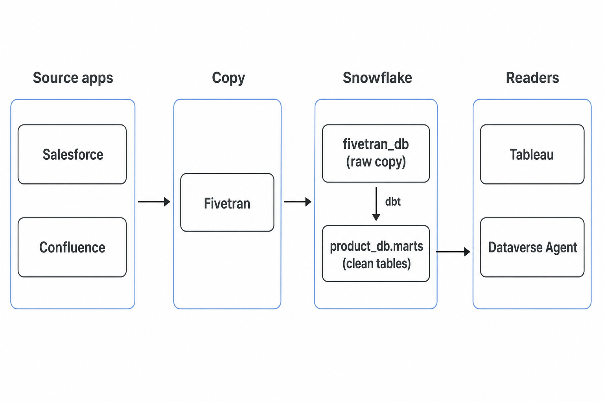
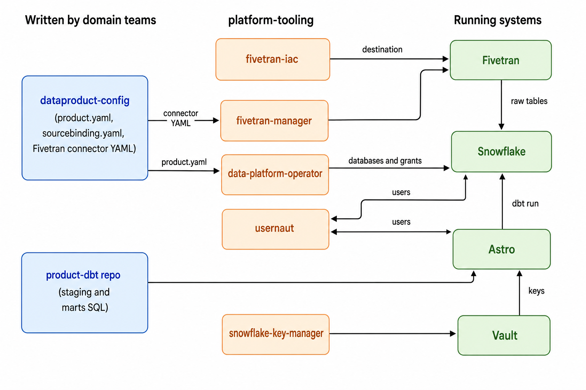

# How this lab maps to Dataverse

This lab copies the Dataverse path on trial accounts: **Google Sheets → Fivetran → Snowflake → dbt**.

Red Hat production uses the same path. The difference is **how** each piece is set up. In the lab, people click forms. In Dataverse, Git files and platform tools apply the same kinds of objects.

[platform-tooling](https://gitlab.cee.redhat.com/dataverse/platform-tooling) is those tools. It does not hold sample CSVs or dbt models. Domain teams write YAML and SQL. The tools apply them.

Not every lab click is automated in that GitLab group. Some objects are created once for the whole platform. Some live in other repos (`dataproduct-config`, `*-dbt`). Some work is still human: what to copy, how to clean it, who owns it.

## Same flow, different setup

```text
Lab:          Google Sheets  →  Fivetran UI     →  trial Snowflake   →  dbt on a laptop
Dataverse:    Salesforce/…   →  Git YAML + APIs →  company Snowflake →  dbt in GitLab / Astro
```

## How the pieces work together

Data still moves the same way as in the lab. Git and platform tools replace the clicks.

**Data path** (same as this lab, with real apps instead of Google Sheets):



**How Git repos and tools connect.** Left = files people write. Middle = platform-tooling. Right = systems that run.



| Repo | Group | Job |
|---|---|---|
| [fivetran-iac](https://gitlab.cee.redhat.com/dataverse/platform-tooling/fivetran-iac) | platform-tooling | Creates the Fivetran → Snowflake **destination** once per environment |
| [fivetran-manager](https://gitlab.cee.redhat.com/dataverse/platform-tooling/fivetran-manager) | platform-tooling | Takes connector YAML, applies it, talks to the Fivetran API |
| [data-platform-operator](https://gitlab.cee.redhat.com/dataverse/platform-tooling/data-platform-operator) | platform-tooling | Creates product databases, schemas, warehouses, grants, source bindings |
| [usernaut](https://gitlab.cee.redhat.com/dataverse/platform-tooling/usernaut) | platform-tooling | Copies Rover groups into Snowflake, Fivetran, and GitLab |
| [snowflake-key-manager](https://gitlab.cee.redhat.com/dataverse/platform-tooling/snowflake-key-manager) | platform-tooling | Rotates Snowflake app keys in Vault |
| [dice](https://gitlab.cee.redhat.com/dataverse/platform-tooling/dice) | platform-tooling | Older CLI for the same Snowflake objects; operator is the current path |
| dataproduct-config | other GitLab group | YAML people write: product, source binding, Fivetran connectors |
| `*-dbt` | other GitLab group | dbt SQL for one data product |
| Astro | not a GitLab “tooling” repo | Schedules `dbt run` |

Read left to right: **Fivetran-iac** points Fivetran at Snowflake. **Fivetran-manager** creates each connector from YAML. Fivetran fills `fivetran_db`. The **operator** builds the empty product database. **dbt** (from the product repo, run by Astro) fills marts. **Usernaut** and **key-manager** handle people and passwords so none of that uses `ACCOUNTADMIN` on a laptop.

## Lab step vs Dataverse

| Lab (manual) | In Dataverse? | What happens |
|---|---|---|
| Sign up Snowflake + Fivetran | No | Company accounts already exist. Access comes from a **Rover** group. |
| `CREATE DATABASE` / `SCHEMA` | **Yes** | [data-platform-operator](https://gitlab.cee.redhat.com/dataverse/platform-tooling/data-platform-operator) reads `product.yaml` and creates the **product** database (`confluence_db`, …), schemas, warehouses, and grants. Older tool: [dice](https://gitlab.cee.redhat.com/dataverse/platform-tooling/dice). |
| Create `FIVETRAN_DB` | **Once, by the platform** | `fivetran_db` already exists. Product YAML does not create it. Fivetran only adds schemas inside it (for example `fivetran_db.confluence_public`). |
| `~/.snowflake/config.toml` + password | No (different auth) | Apps use **key pairs** in Vault. [snowflake-key-manager](https://gitlab.cee.redhat.com/dataverse/platform-tooling/snowflake-key-manager) rotates them. People are not `ACCOUNTADMIN`. |
| Import CSV into Google Sheets | No | Sources are real apps (Salesforce, Confluence, …). |
| Fivetran **source** form | **Yes, as Git** | Connector YAML lives in **dataproduct-config** (not platform-tooling). [fivetran-manager](https://gitlab.cee.redhat.com/dataverse/platform-tooling/fivetran-manager) validates it and applies a Kubernetes object. That object talks to the Fivetran API. Nobody fills the Fivetran website form for a new connector. |
| Fivetran **destination** form | **Yes, once per environment** | [fivetran-iac](https://gitlab.cee.redhat.com/dataverse/platform-tooling/fivetran-iac) Terraform: one Snowflake destination for the platform, not one per person. |
| Start Initial Sync | Schedule / API | Pause and schedule are set in YAML. CI can test connectors. |
| `profiles.yml` + `dbt run` on a laptop | **Yes, as Git + CI** | Each product has a `*-dbt` GitLab repo. A merge runs dbt. **Astro** (Airflow) runs it on a schedule. That is not in `platform-tooling`. |
| Who can log into Snowflake / Fivetran | **Yes** | [usernaut](https://gitlab.cee.redhat.com/dataverse/platform-tooling/usernaut) syncs Rover groups to Snowflake, Fivetran, and GitLab. Join and leave are automatic. |

The **objects** created by clicking in the lab are automated. The **decisions** (what to copy, how to clean it, who owns it) stay in Git, written by people.

## What platform-tooling does

Three jobs:

1. **Copy in** — Fivetran destination ([fivetran-iac](https://gitlab.cee.redhat.com/dataverse/platform-tooling/fivetran-iac)) and connector deploy ([fivetran-manager](https://gitlab.cee.redhat.com/dataverse/platform-tooling/fivetran-manager)).
2. **Snowflake objects** — databases, schemas, grants, and which product owns which raw schema ([data-platform-operator](https://gitlab.cee.redhat.com/dataverse/platform-tooling/data-platform-operator)). DICE is the older CLI for the same idea.
3. **People and keys** — [usernaut](https://gitlab.cee.redhat.com/dataverse/platform-tooling/usernaut) and [snowflake-key-manager](https://gitlab.cee.redhat.com/dataverse/platform-tooling/snowflake-key-manager).

Other repos in that group (Skillshub, Atlan webhook, and similar) are not part of this Sheets → marts path.

## What is still written by people

Setup is a Git merge, not a Fivetran click:

- `product.yaml` — product database and warehouses
- Fivetran connector YAML — source and schema
- `sourcebinding.yaml` — which raw Fivetran schema the product owns
- dbt SQL — staging and marts
- Merge request review

If Fivetran cannot copy a source, a team may run a small job on OpenShift instead.

## Side by side

```text
This lab                           Dataverse
────────                           ─────────
Trial accounts                     Shared Snowflake + Fivetran (already there)
ACCOUNTADMIN + password            Rover group → Usernaut; keys in Vault
CREATE DATABASE in Workspaces      product.yaml → Operator
Fivetran website forms             YAML → fivetran-manager / fivetran-iac
dbt on a laptop                    GitLab *-dbt + Astro
Google Sheets sample               Real apps (Salesforce, …)
```

Lab clicks are a stand-in for GitOps. `platform-tooling` is the automation, not the full platform. Product YAML and dbt live in other GitLab groups. `fivetran_db` and the Fivetran Snowflake destination are platform-wide, not created once per person.
